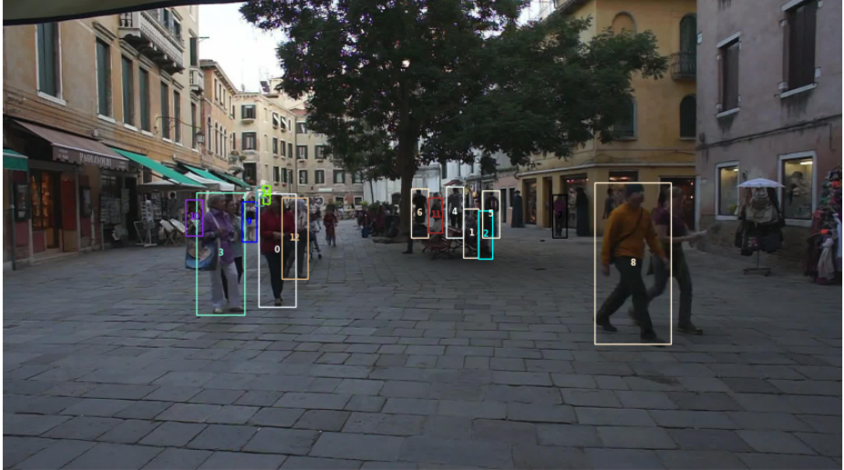

# Multiple Object Tracking (MOT)

In this project, we created a tracker using a ReID model for precise appearance-based matching to track multiple pedestrians within video sequences. Our tracker incorporates Faster R-CNN as the object detector. The ReID model is based on ResNet-34, trained with Triplet Loss and Cross-Entropy Loss. Its performance is evaluated using cosine distance measurements.

## Dataset

MOTA16 

## Results

(Please refer to MOTA.ipynb for more detail)

We plot the result of our model on the 10 consecutive frames of the video sequence 

  

